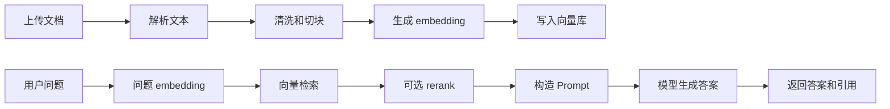

# Java 后端程序员 AI 应用开发学习路线

> 本文档的工程权威版本位于 `java-ai-application-lab` 仓库。个人知识库或飞书中的副本仅用于阅读和导入。

文档版本：2026-06-29  
适用对象：有 Java 后端经验，并具备少量前端基础的开发者  
推荐主线：Spring Boot + Spring AI + PostgreSQL/pgvector + React/Vue + Docker  

## 1. 总体判断

Java 适合做 AI 应用开发，尤其适合企业级 AI 应用的后端部分。

AI 应用开发的核心是把大模型能力安全、稳定、可观测地接入业务系统。对 Java 后端来说，真正有价值的能力集中在这些方向：

- 业务系统集成
- 权限和数据边界
- 工具调用和业务接口编排
- RAG 知识库问答
- 异步任务和状态管理
- 审计、日志、监控、成本治理
- 安全策略和生产化交付

模型训练、算法实验、数据科学探索仍然以 Python 生态为主。企业 AI 应用落地更依赖后端工程、业务集成和稳定交付，Java 是非常现实的主力技术栈。

## 2. 推荐技术栈

### 2.1 默认主线

| 层级 | 推荐技术 | 说明 |
|---|---|---|
| 后端语言 | Java 21 | 长期支持版本，适合新项目 |
| Web 框架 | Spring Boot 3.x | 复用 Java 企业应用生态 |
| AI 框架 | Spring AI | 与 Spring 生态集成好，适合作为主线 |
| AI 框架备选 | LangChain4j | 适合理解另一套 Java AI 抽象，也可用于非 Spring 项目 |
| 数据库 | PostgreSQL | 业务数据和向量数据可先统一管理 |
| 向量检索 | pgvector | 入门和中小规模 RAG 优先选择 |
| 缓存 | Redis | 会话、限流、任务状态、缓存 |
| 文档存储 | MinIO / S3 | 存 PDF、Word、Markdown、图片等原始文件 |
| 异步任务 | Spring Task / MQ / Spring Batch | 文档解析、embedding、评测等任务异步化 |
| 前端 | React + TypeScript 或 Vue 3 | 做 Chat UI、知识库后台、评测面板 |
| 部署 | Docker Compose | 学习阶段足够，后续再上 Kubernetes |
| 可观测性 | OpenTelemetry + Prometheus + Grafana | 生产化阶段补齐 |
| 测试 | JUnit 5 + Testcontainers | 做接口、数据库、RAG 管道验证 |

### 2.2 备选技术的触发条件

| 触发条件 | 可以考虑 |
|---|---|
| 向量数据量明显变大，pgvector 性能吃紧 | Qdrant、Milvus、Elasticsearch Vector |
| 需要复杂长流程、补偿、人工审批、可恢复执行 | Temporal、Camunda、Flowable |
| 只做快速 AI 原型 | Python / TypeScript 可能更快 |
| 需要模型微调和数据实验 | Python + Hugging Face + PyTorch |
| 需要本地推理实验 | Ollama、llama.cpp |
| 需要高并发本地推理服务 | vLLM |

学习阶段先固定一条主线，控制技术选项数量：

```text
Spring Boot
+ Spring AI
+ PostgreSQL / pgvector
+ Redis
+ MinIO
+ React 或 Vue
+ Docker Compose
```

## 3. 先建立几个关键认知

### 3.1 AI 应用开发的重点是应用落地

大多数业务场景需要你：

1. 选择合适的模型服务。
2. 设计 Prompt 和结构化输出。
3. 接入企业数据。
4. 让模型调用业务工具。
5. 控制权限和数据边界。
6. 建立评测、日志、成本和安全体系。

### 3.2 Java 和 Python 的合理分工

| 工作内容 | 推荐语言 |
|---|---|
| 业务后端 | Java |
| AI 接口封装 | Java |
| RAG 服务 | Java |
| Tool Calling | Java |
| Agent 工作流 | Java |
| 管理后台接口 | Java |
| 前端页面 | React / Vue |
| 数据分析实验 | Python |
| 模型微调 | Python |
| 开源模型实验 | Python / Ollama / vLLM |

更务实的路线是：主系统继续用 Java，模型和数据实验用 Python 辅助。

### 3.3 数据合规要前置

AI 应用的高风险之一是数据外发。

如果你把企业内部文档、简历、订单、合同、客服记录、财务数据发送给外部模型 API，可能涉及：

- 数据出境
- 商业秘密泄露
- 个人信息保护
- 合同合规
- 行业监管要求
- 日志和训练数据留存风险

在阶段 0 或阶段 1 就要明确数据边界：

| 数据类型 | 推荐处理 |
|---|---|
| 公开资料 | 可用公有模型 API |
| 普通内部资料 | 优先做脱敏和访问控制 |
| 客户隐私、订单、合同、简历 | 先确认合规和授权 |
| 金融、医疗、政企敏感数据 | 优先企业云、私有化或本地模型 |
| 密钥、令牌、身份证、银行卡 | 只在受控密钥或身份系统中使用 |

模型服务选型需要同时看效果、价格、数据处理条款、地域、日志策略和企业合规能力。

## 4. 学习路线总览

| 阶段 | 目标 | 推荐周期 |
|---|---|---:|
| 阶段 0 | AI 应用基础和合规边界 | 1 周 |
| 阶段 1 | LLM API 与聊天服务 | 1-2 周 |
| 阶段 2 | Prompt 与结构化输出 | 2 周 |
| 阶段 3 | Embedding 与 RAG 知识库 | 4-6 周 |
| 阶段 4 | Tool Calling 与业务接口 | 3-4 周 |
| 阶段 5 | Agent 和工作流 | 4-6 周 |
| 阶段 6 | 评测、安全、可观测性 | 4-6 周 |
| 阶段 7 | 生产化和成本治理 | 4-8 周 |
| 阶段 8 | 模型进阶和本地推理 | 长期 |

说明：这个周期是投入较充分时的下限。18 周左右可以做出像样的原型和个人作品集；生产级 AI 平台还需要更长时间的工程化、评测和治理。

## 5. 阶段 0：AI 应用基础和合规边界

### 5.1 学习目标

建立 AI 应用开发的基本概念，知道一个 LLM 应用由哪些部分组成，并在一开始明确数据边界。

补充文档：

- [阶段 0：必须理解的 AI 应用基础概念](../stages/stage-00-ai-application-basics.md)
- [阶段 0：数据分级与模型调用边界清单](../stages/stage-00-data-boundary.md)

### 5.2 必须理解的概念

| 概念 | 要理解到什么程度 |
|---|---|
| LLM | 知道它根据上下文生成结果，和数据库查询机制不同 |
| Token | 理解上下文长度、费用、延迟都和 token 有关 |
| Context Window | 一次请求能放多少历史和资料 |
| Prompt | 如何组织指令、约束、上下文、示例 |
| Temperature | 如何影响稳定性和创造性 |
| Hallucination | 模型可能编造答案 |
| Embedding | 把文本变成向量，用于相似度检索 |
| RAG | 先检索资料，再让模型基于资料回答 |
| Tool Calling | 让模型选择并调用后端函数 |
| Agent | 有状态、多步骤、可调用工具的任务执行系统 |

### 5.3 要做的事情

1. 选择一个模型服务。
2. 申请 API Key，并只通过环境变量使用。
3. 写一个最小 Java 命令行程序。
4. 输入一个问题。
5. 调用模型 API。
6. 打印结果。
7. 记录请求耗时和异常。
8. 明确数据发送边界。

### 5.4 验收标准

- 能通过 Java 程序成功调用模型。
- API Key 只通过环境变量或本地密钥管理方式使用。
- 能说清楚 token、上下文窗口、embedding、RAG、tool calling 的基本含义。
- 有一份简单的数据分级规则。

## 6. 阶段 1：LLM API 与聊天服务

### 6.1 学习目标

做出一个稳定的 AI 聊天后端接口，具备 API 形态、异常处理和基础日志。

补充文档：

- [阶段 1：LLM 聊天服务实现手册](../stages/stage-01-llm-chat-service.md)

### 6.2 推荐技术

| 类型 | 技术 |
|---|---|
| 后端 | Java 21、Spring Boot 3.x |
| AI 框架 | Spring AI |
| 备选 | LangChain4j |
| 前端 | React / Vue |
| 存储 | PostgreSQL |
| 流式输出 | SSE 或 WebFlux Flux |

### 6.3 要做的功能

1. `/api/chat` 普通聊天接口。
2. `/api/chat/stream` 流式聊天接口。
3. 会话创建、查询、删除。
4. 消息历史保存。
5. 模型参数配置：model、temperature、max tokens。
6. 异常处理：超时、限流、模型错误、空响应。
7. 基础日志：用户、会话、模型、耗时、token 估算。

### 6.4 关键工程点

多轮对话需要控制写入上下文的历史长度。你需要尽早考虑：

- 按最大 token 截断历史。
- 保留最近 N 轮对话。
- 对早期对话做摘要。
- 区分系统提示词、用户消息、模型消息。
- 对敏感信息做脱敏后再记录日志。

流式输出可以优先使用 SSE。WebFlux 更强，但学习成本更高；如果项目本来是 Spring MVC，先用 SSE 更直接。

### 6.5 验收标准

| 能力 | 验收方式 |
|---|---|
| 普通聊天可用 | Postman 或前端能提问并获得回答 |
| 流式输出可用 | 前端能逐步显示模型输出 |
| 多轮对话可用 | 模型能理解前文 |
| 历史可控 | 长对话不会无限膨胀 |
| 异常清晰 | 模型失败时返回明确错误 |
| 日志可查 | 能看到耗时、模型、会话、错误 |

## 7. 阶段 2：Prompt 与结构化输出

### 7.1 学习目标

让模型输出可被后端程序稳定消费。

很多 AI 应用场景需要模型输出 JSON、枚举、列表、分类结果、风险标签，然后由后端继续处理。

补充文档：

- [阶段 2：Prompt 与结构化输出实战](../stages/stage-02-prompt-structured-output.md)

### 7.2 推荐技术

| 类型 | 技术 |
|---|---|
| 结构化输出 | Spring AI Structured Output / LangChain4j structured output |
| JSON 处理 | Jackson |
| 校验 | JSON Schema、Jakarta Validation |
| 测试 | JUnit 5 |

### 7.3 要学的内容

1. System Prompt、User Prompt、上下文 Prompt 的分层。
2. Few-shot 示例的使用时机。
3. JSON 输出约束。
4. JSON Schema 或 POJO 映射。
5. 反序列化和字段校验。
6. 输出格式错误时的重试策略。
7. Prompt 版本管理。
8. 结果可信度和人工复核。

### 7.4 练手项目：简历信息抽取器

输入一段简历文本，输出结构化结果：

```json
{
  "name": "张三",
  "yearsOfExperience": 5,
  "skills": ["Java", "Spring Boot", "MySQL"],
  "lastCompany": "某公司",
  "education": "本科",
  "riskNotes": []
}
```

### 7.5 验收标准

| 能力 | 验收方式 |
|---|---|
| 输出合法 JSON | Jackson 能反序列化 |
| 类型稳定 | 年限使用数字格式 |
| 空值清晰 | 不知道时返回 null 或空数组 |
| 可校验 | DTO 校验能发现异常字段 |
| 有测试集 | 至少准备 20 份样例 |
| 可回归 | 修改 Prompt 后能重新跑测试集 |

### 7.6 常见风险

- 只靠 Prompt 约束，不做后端校验。
- 模型输出稍微变形就导致接口失败。
- 把模型抽取结果直接作为事实使用。
- 缺少原始输入和模型输出，问题无法追踪。

## 8. 阶段 3：Embedding 与 RAG 知识库

### 8.1 学习目标

做一个可以上传文档、检索资料、基于资料回答、返回引用来源的知识库问答系统。

RAG 是企业 AI 应用最常见的落地方向之一。

补充文档：

- [阶段 3：RAG 知识库设计](../stages/stage-03-rag-knowledge-base.md)

### 8.2 推荐技术

| 类型 | 默认主线 |
|---|---|
| 文档解析 | Apache Tika、PDFBox、docx4j |
| 文档存储 | MinIO / S3 |
| 向量存储 | PostgreSQL + pgvector |
| AI 框架 | Spring AI RAG |
| 备选框架 | LangChain4j RAG |
| 异步处理 | Spring Task，后续可上 MQ |

### 8.3 RAG 基本流程



### 8.4 pgvector 和 rerank 的边界

`pgvector` 负责：

- 存储向量
- 计算向量距离
- 做近邻检索
- 使用 HNSW / IVFFlat 等索引提高查询速度

`pgvector` 不负责 rerank。

rerank 是检索后的第二阶段，通常需要独立的重排模型，例如：

- bge-reranker 系列
- Cohere Rerank
- Jina reranker
- 其他中文或多语种重排模型

一个更完整的检索链路是：

```text
用户问题
-> embedding
-> pgvector TopK 召回
-> rerank 模型重排
-> 选出最终上下文
-> LLM 生成答案
```

### 8.5 中文 Embedding 选型

中文知识库一定要重视 embedding 和 rerank 模型。英文效果好的 embedding 模型，迁移到中文资料前需要单独验证。

可关注这些方向：

| 场景 | 可选方向 |
|---|---|
| 中文知识库 | bge 中文/多语种系列、通义 embedding、智谱 embedding |
| 中英混合知识库 | multilingual-e5、bge-m3 等多语种模型 |
| 需要高质量排序 | bge-reranker、Cohere Rerank、Jina reranker |
| 企业内网和敏感数据 | 本地部署 embedding / rerank 模型 |

选型时结合模型榜单、自己的文档和问题集测试召回效果。

### 8.6 要做的功能

1. 上传 PDF、Word、Markdown、TXT。
2. 保存原始文件。
3. 异步解析文档。
4. 清洗页眉、页脚、目录、重复空行。
5. 按标题、段落、token 长度切块。
6. 为每个 chunk 生成 embedding。
7. 写入向量库。
8. 用户提问时检索相关 chunk。
9. 可选 rerank。
10. 构造带资料来源的 Prompt。
11. 生成答案。
12. 返回引用文档、段落、页码或 chunk id。
13. 无资料依据时拒答。
14. 检索阶段加入权限过滤。

### 8.7 验收问题集

准备至少 50 个问题：

| 类型 | 数量 |
|---|---:|
| 文档中有明确答案 | 20 |
| 需要综合多个段落 | 10 |
| 无答案问题 | 10 |
| 容易混淆的问题 | 10 |

### 8.8 评估指标

| 指标 | 说明 |
|---|---|
| TopK 召回率 | 正确 chunk 是否出现在前 K 个结果中 |
| 答案正确率 | 回答是否符合资料 |
| 引用准确率 | 引用是否真的支撑答案 |
| 拒答率 | 无资料问题是否拒绝编造 |
| 平均延迟 | 检索 + rerank + 生成总耗时 |
| 单次成本 | embedding、rerank、LLM token 成本 |

### 8.9 常见风险

- chunk 太短，语义不完整。
- chunk 太长，检索不准且浪费 token。
- 只做向量检索，不做关键词检索或 rerank。
- 中文 embedding 模型选错。
- 检索结果缺少权限过滤。
- 模型答案缺少引用来源。
- 无资料时仍然编造。

## 9. 阶段 4：Tool Calling 与业务接口

### 9.1 学习目标

让模型安全地调用你的 Java 业务能力。

Tool Calling 的重点是让模型调用函数时仍然遵守权限、参数校验、审计、幂等和业务规则。

补充文档：

- [阶段 4：Tool Calling 与业务接口设计](../stages/stage-04-tool-calling.md)

### 9.2 推荐技术

| 类型 | 技术 |
|---|---|
| 工具调用 | Spring AI Tool Calling |
| 备选 | LangChain4j Tools |
| 权限 | Spring Security |
| 参数校验 | DTO + Jakarta Validation |
| 审计 | 操作日志 + traceId |
| 写操作安全 | 人工确认 + 幂等 + 原业务校验 |

### 9.3 练手项目：智能客服助手

支持这些问题：

| 用户问题 | 后端工具 |
|---|---|
| 我的订单到哪了 | 查询订单 |
| 退款什么时候到账 | 查询退款 |
| 这个商品还有库存吗 | 查询库存 |
| 帮我取消订单 | 二次确认后取消 |
| 帮我修改收货地址 | 身份校验 + 二次确认 |

### 9.4 工具设计原则

1. 工具入参必须是明确 DTO。
2. 参数必须做后端校验。
3. 用户身份从登录态获取，不由模型生成。
4. 查询类工具可以自动执行。
5. 写操作必须二次确认。
6. 资金、权限、合同等高风险操作必须走原业务流程。
7. 所有工具调用必须有审计日志。
8. 模型调用必须通过业务权限校验。

### 9.5 验收标准

| 能力 | 验收方式 |
|---|---|
| 工具选择准确 | 问订单时调用订单工具 |
| 参数正确 | 订单号和用户 id 来自可信来源 |
| 权限有效 | 越权查询会被拒绝 |
| 写操作安全 | 取消订单前必须确认 |
| 审计完整 | 能看到谁何时调用了什么工具 |
| 失败可解释 | 工具失败时模型能给出合理说明 |

## 10. 阶段 5：Agent 和工作流

### 10.1 学习目标

做一个有状态、有步骤、有工具、有失败处理、有人工确认的半自动业务助手。

Agent 的稳妥理解是：

```text
Agent = LLM + 工具 + 状态 + 计划 + 约束 + 人工确认 + 失败处理
```

补充文档：

- [阶段 5：Agent 与工作流设计](../stages/stage-05-agent-workflow.md)

### 10.2 推荐技术

学习阶段先用：

- Spring Boot
- PostgreSQL 状态表
- Redis 可选
- 应用层状态机
- Spring AI / LangChain4j

业务复杂后再考虑：

- Temporal
- Camunda
- Flowable
- Spring Statemachine

学习阶段先用应用层状态机，把 Agent 的状态、边界和确认机制做清楚。

### 10.3 练手项目：需求分析 Agent

输入一段产品需求，让 Agent 完成：

1. 读取需求。
2. 提取业务目标。
3. 拆分后端接口。
4. 生成数据库表草案。
5. 识别风险点。
6. 生成测试用例。
7. 等用户确认。
8. 输出最终方案。

先做辅助分析型 Agent，自动改代码、自动发版、自动操作生产数据留到具备完整治理后再评估。

### 10.4 状态设计示例

| 状态 | 说明 |
|---|---|
| CREATED | 任务已创建 |
| PLANNING | 正在分析需求 |
| WAITING_CONFIRMATION | 等待用户确认 |
| EXECUTING | 正在执行工具或步骤 |
| FAILED | 某一步失败 |
| CANCELLED | 用户取消 |
| COMPLETED | 任务完成 |

### 10.5 验收标准

| 能力 | 验收方式 |
|---|---|
| 有任务状态 | 页面能看到当前执行到哪一步 |
| 有中间结果 | 每一步输入输出可查看 |
| 可暂停确认 | 高风险步骤等待用户 |
| 可重试 | 某一步失败可单独重试 |
| 可追踪 | 每一步有耗时、模型、工具调用记录 |

## 11. 阶段 6：评测、安全、可观测性

### 11.1 学习目标

从“能跑”进入“可评估、可排查、可控风险”。

生产级 AI 应用需要可重复的测试集、日志、指标和安全边界。

补充文档：

- [阶段 6：评测、安全、可观测性体系](../stages/stage-06-evaluation-security-observability.md)

### 11.2 评测体系

至少建立这些评测集：

| 类型 | 用途 |
|---|---|
| 聊天基础问题 | 验证基础问答稳定性 |
| 结构化抽取样例 | 验证 JSON 和字段准确率 |
| RAG 问题集 | 验证召回和答案 |
| 无答案问题 | 验证拒答能力 |
| 攻击样例 | 验证 prompt injection 和越权 |
| 工具调用样例 | 验证工具选择和参数 |

评测方式：

- 人工标注标准答案。
- 程序校验 JSON 和枚举。
- 统计召回率、正确率、拒答率。
- LLM-as-judge 可作为辅助，人工基准仍是关键。
- Prompt、模型、embedding、rerank 变更后要跑回归。

Spring AI 和其他框架可以提供 evaluation 工具，但严肃评测仍需要你自建测试集、基线和评估流程。

### 11.3 安全重点

参考 OWASP LLM Top 10，需要重点关注：

- Prompt Injection
- 敏感信息泄露
- 供应链风险
- 数据和模型投毒
- 输出处理不当
- 过度代理和越权工具调用
- 系统提示词泄露
- 向量库和 embedding 风险
- 错误信息和幻觉
- 资源滥用和成本攻击

### 11.4 必备防护

| 机制 | 作用 |
|---|---|
| 输入过滤 | 识别明显攻击和异常输入 |
| 输出校验 | 防止错误内容直接进入业务系统 |
| 权限检查 | 每次工具调用都走后端权限 |
| 人工确认 | 写操作和高风险操作必须确认 |
| 检索权限 | RAG 召回阶段过滤数据权限 |
| 脱敏 | Prompt 和日志中处理敏感信息脱敏 |
| 费用限额 | 防止无限调用和高额账单 |
| 审计日志 | 追踪用户、模型、工具、结果 |

### 11.5 可观测性指标

| 指标 | 说明 |
|---|---|
| 请求量 | 总调用次数 |
| 成功率 | 模型调用和业务接口成功率 |
| 平均延迟 | 模型、检索、rerank、工具耗时 |
| token 消耗 | 输入、输出、总 token |
| 单次成本 | 每次请求成本 |
| RAG 命中率 | 正确资料是否被召回 |
| 工具调用次数 | 模型调用了哪些工具 |
| 用户反馈 | 点赞、点踩、人工纠错 |

## 12. 阶段 7：生产化和成本治理

### 12.1 学习目标

让 AI 应用具备上线所需的稳定性、可维护性和成本控制能力。

补充文档：

- [阶段 7：生产化与成本治理](../stages/stage-07-production-cost-governance.md)

### 12.2 要做的事情

1. 配置中心管理模型参数。
2. Prompt 版本管理。
3. 模型服务超时和重试策略。
4. 多模型路由：简单任务用便宜模型，复杂任务用强模型。
5. token 和费用统计。
6. 缓存策略。
7. 限流和用户配额。
8. 异步任务队列。
9. 灰度发布。
10. 回滚策略。
11. 监控和报警。

### 12.3 缓存分类

| 类型 | 说明 |
|---|---|
| 普通缓存 | 相同请求直接复用结果 |
| 语义缓存 | 语义相近的问题复用结果，需要谨慎 |
| Prompt 缓存 | 利用模型服务的上下文缓存能力，降低成本 |
| RAG 检索缓存 | 缓存检索结果或 rerank 结果 |

语义缓存仅用于低风险、权限边界一致的数据结果。

### 12.4 模型分层策略

| 任务 | 模型策略 |
|---|---|
| 简单分类 | 小模型 |
| JSON 抽取 | 支持结构化输出的稳定模型 |
| 普通知识问答 | 中等模型 |
| 复杂推理 | 强模型 |
| 敏感数据 | 私有化或合规模型 |
| 大批量离线任务 | 成本优先模型 |

## 13. 阶段 8：模型进阶和本地推理

### 13.1 学习目标

理解模型基础，知道什么时候需要微调、本地模型和推理优化。

补充文档：

- [阶段 8：模型进阶与本地推理入门](../stages/stage-08-model-local-inference.md)

### 13.2 学习内容

| 内容 | 学到什么程度 |
|---|---|
| Transformer | 理解 attention、上下文、位置编码的大概原理 |
| Tokenizer | 理解文本如何变成 token |
| Embedding | 理解语义向量、相似度、维度 |
| Fine-tuning | 知道适用场景和成本 |
| LoRA / QLoRA | 理解低成本微调思路 |
| Rerank | 理解为什么 RAG 需要第二阶段排序 |
| 本地模型 | 会用 Ollama 跑模型 |
| 推理服务 | 了解 vLLM、llama.cpp |
| 推理优化 | 了解量化、批处理、KV cache |

### 13.3 什么时候考虑微调

优先顺序通常是：

```text
Prompt 优化
-> 结构化输出约束
-> RAG 补充知识
-> 工具调用
-> 评测和数据修正
-> 微调
```

只有当模型需要稳定学习某种格式、风格、分类边界或特定任务模式，并且你有足够高质量样本时，才考虑微调。

## 14. 推荐项目路线

补充文档：

- [AI 应用开发实战项目路线](./project-evolution-roadmap.md)

### 项目 1：AI Chat API

目标：掌握模型调用、流式输出、多轮对话、异常处理。

功能：

- 普通聊天
- 流式聊天
- 会话历史
- token 统计
- 错误处理

### 项目 2：简历信息抽取器

目标：掌握 Prompt、结构化输出、JSON 校验、测试集。

功能：

- 输入简历文本
- 输出结构化 JSON
- 字段校验
- 失败重试
- 样例回归测试

### 项目 3：企业知识库问答

目标：掌握 RAG。

功能：

- 文档上传
- 文档解析
- chunk 切分
- embedding
- pgvector 检索
- 可选 rerank
- 引用来源
- 无资料拒答
- 权限过滤

### 项目 4：智能客服助手

目标：掌握 RAG + Tool Calling。

功能：

- 查询订单
- 查询退款
- 查询库存
- 取消订单二次确认
- 修改地址二次确认
- 工具调用审计

### 项目 5：业务办理助手

目标：掌握 Agent 状态管理和人工确认。

功能：

- 多步骤任务
- 状态持久化
- 用户确认
- 单步重试
- 执行日志

### 项目 6：AI 应用管理后台

目标：掌握生产治理。

功能：

- 模型调用记录
- token 成本统计
- Prompt 版本管理
- RAG 召回记录
- 工具调用审计
- 用户反馈
- 评测结果
- 异常报警

### 项目 7：本地模型实验室

目标：理解模型选型和成本差异。

功能：

- Ollama 本地模型调用
- API 模型对比
- embedding 模型对比
- rerank 模型对比
- 延迟和成本统计

## 15. 建议学习节奏

如果每周投入 8-10 小时，建议按 6-9 个月安排。

| 周数 | 任务 |
|---|---|
| 第 1 周 | LLM 基础、数据边界、API 调用 |
| 第 2-3 周 | Spring AI 入门、聊天接口、流式输出 |
| 第 4-5 周 | Prompt、结构化输出、简历抽取器 |
| 第 6-10 周 | 文档解析、embedding、pgvector、RAG |
| 第 11-13 周 | 中文 embedding、rerank、RAG 评测 |
| 第 14-17 周 | Tool Calling、业务接口、权限和审计 |
| 第 18-22 周 | Agent 状态机、人工确认、失败重试 |
| 第 23-28 周 | 评测、安全、可观测性、成本治理 |
| 第 29 周以后 | 本地模型、微调、推理优化、多模态 |

如果只能每周投入 3-5 小时，周期至少翻倍。

## 16. 学习资料优先级

建议优先看官方资料，减少过时教程干扰。

| 资料 | 重点 |
|---|---|
| Spring AI 官方文档 | Chat、Embedding、Vector Store、RAG、Tool Calling、Structured Output、Evaluation、Observability |
| LangChain4j 官方文档 | AI Services、Tools、RAG、Memory、Structured Output |
| OpenAI / Claude / Gemini 官方文档 | structured output、tool calling、streaming、evals、safety |
| pgvector 文档 | vector 类型、距离函数、HNSW、IVFFlat |
| OWASP LLM Top 10 | LLM 应用安全风险 |
| Hugging Face LLM Course | Transformer、tokenizer、fine-tuning、datasets |

参考链接：

- Spring AI: https://docs.spring.io/spring-ai/reference/index.html
- LangChain4j: https://docs.langchain4j.dev/
- pgvector: https://github.com/pgvector/pgvector
- OWASP LLM Top 10: https://genai.owasp.org/llm-top-10/
- Hugging Face LLM Course: https://huggingface.co/learn/llm-course
- OpenAI API 文档: https://platform.openai.com/docs

## 17. 最终能力目标

按这条路线学习后，你应该能独立设计和实现：

- 企业知识库问答系统
- 智能客服助手
- AI 数据查询助手
- AI 文档分析助手
- AI 代码和需求分析助手
- 带人工确认的业务办理 Agent
- 带评测、审计、成本统计的 AI 应用后台

更重要的是，你应该能判断：

- 数据发送边界。
- 什么时候用 RAG，什么时候用微调。
- 什么时候需要 tool calling，什么时候只需要普通问答。
- 什么时候可以自动执行，什么时候必须人工确认。
- 如何评估模型变更是否变好。
- 如何让 AI 应用具备上线条件。

## 18. 给 Java 后端的核心建议

1. 继续发挥 Java 后端优势。
2. 优先学习模型调用、RAG、Tool Calling 等应用层能力，再按需进入模型训练。
3. 先把 Chat、结构化输出、RAG、Tool Calling 做扎实。
4. 中文 RAG 必须重视 embedding 和 rerank 选型。
5. 数据合规和权限边界要从第一天开始考虑。
6. Agent 先从半自动和人工确认开始。
7. 用评测集证明效果变化。
8. 日志、审计、限流、成本统计是生产级 AI 应用的基础。

这条路线的本质是：用 Java 的工程能力，把大模型变成可靠的业务能力。
